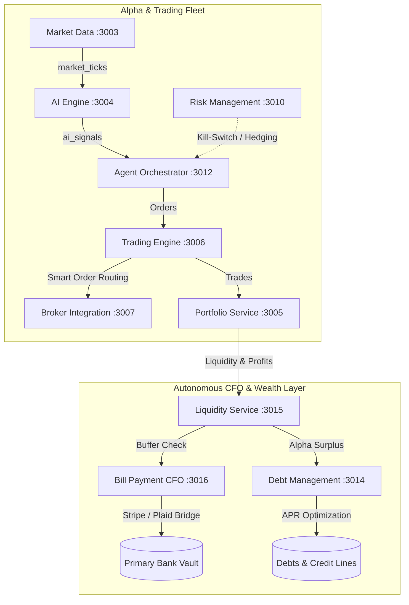

# 🏛️ Sovereign AI: Autonomous Financial CFO & Trading Fleet

**Sovereign AI** (v2.0.4) is an institutional-grade, zero-intervention financial intelligence ecosystem. It integrates high-frequency algorithmic trading, machine-learning alpha generation, real-time risk hedging, and an **Autonomous CFO** that settles real-world liabilities, manages debts, and maintains liquidity across 16 coordinated microservices.

---

## ⚡ Quick Navigation

- [Fleet Architecture & Port Matrix](./references/fleet_architecture.md)
- [Operational Runbooks (Start/Stop/Migrate)](./references/operational_runbooks.md)
- [Troubleshooting & Remediation Matrix](./references/troubleshooting_matrix.md)

---

## 🦅 Core Subsystems & Operational Loops

The platform operates across two intertwined autonomous loops:



### 1. The Autonomous Alpha Hunter & Protective Hedging Loop
- **Market Ingestion**: Real-time tick stream processed by [`market-data-service`](file:///d:/stock%20market%20agent/services/market-data-service) over WebSockets/Kafka.
- **Inference Engine**: [`ai-engine-service`](file:///d:/stock%20market%20agent/services/ai-engine-service/app_v2.py) computes technical momentum, LSTM neural predictions, and financial news sentiment (`-1.0` to `+1.0`), publishing structured signals to Kafka `ai_signals`.
- **Signal Thresholding**: [`agent-orchestrator`](file:///d:/stock%20market%20agent/services/agent-orchestrator/src/index.ts) filters incoming signals. Only signals with **confidence >= 75%** and active directional bias (`BUY` or `SELL`) trigger execution.
- **Dynamic Sizing & Smart Routing**: Allocates position sizes based on confidence score and strategy type, forwarding orders to [`trading-engine-service`](file:///d:/stock%20market%20agent/services/trading-engine-service) and [`BrokerRegistry`](file:///d:/stock%20market%20agent/services/broker-integration-service/src/BrokerRegistry.ts).
- **Protective Hedging**: Automatically triggers inverse protective hedging (e.g., SQQQ/VIX) if systemic market entropy exceeds 3-sigma thresholds.

### 2. The CFO Liveness & Settlement Loop
- **Liveness Preservation**: Prioritizes living expenses (rent, utilities, operational overhead) before any capital can be allocated to aggressive trading strategies.
- **Autonomous Settlement**: [`bill-payment-service`](file:///d:/stock%20market%20agent/services/bill-payment-service/src/index.ts) executes a periodic 60-second scan over pending bills in PostgreSQL, verifies cash reserves in [`portfolio-service`](file:///d:/stock%20market%20agent/services/portfolio-service), and executes payments via Stripe/Plaid gateways.
- **Debt Rebalancing**: Excess trading alpha is directed by [`debt-management-service`](file:///d:/stock%20market%20agent/services/debt-management-service) into highest-APR liabilities (Avalanche/Snowball method) to minimize interest leakage.
- **Emergency Capital Sweep**: In severe drawdowns (>10%), [`liquidity-management-service`](file:///d:/stock%20market%20agent/services/liquidity-management-service) triggers an automated sweep from broker accounts back into offline bank reserves.

---

## 🔐 Security & Institutional Vault Guidelines

All broker credentials and sensitive keys are guarded with multi-layer **AES-256-CBC** cryptography via [`SecurityVault`](file:///d:/stock%20market%20agent/libs/security-util/src/index.ts).

### Master Encryption Key Rules
1. `SYSTEM_ENCRYPTION_KEY` in [`.env`](file:///d:/stock%20market%20agent/.env) **must be exactly 32 characters** (256 bits).
2. Never store raw broker tokens in plaintext. Always use the encryption CLI:
   ```bash
   npx tsx scripts/encrypt_token.ts "<RAW_TOKEN>"
   ```
3. When rotating master keys, execute [`scripts/rotate_keys.ts`](file:///d:/stock%20market%20agent/scripts/rotate_keys.ts).

---

## 🚀 Execution & Verification Runbook

### Primary Commands Cheatsheet

| Task | Platform | Command |
|---|---|---|
| **Realtime Stack** | Windows | `.\start-realtime-system.bat` |
| **Complete Fleet** | Docker | `docker-compose -f docker-compose-complete.yml up -d` |
| **Apply DB Schema** | Node.js | `node scripts/setup-db.js` |
| **Seed Database** | NPM | `npm run db:seed` |
| **Run Unit Tests** | Jest | `npm run test:unit` |
| **Run All Tests** | Jest | `npm run test:all` |
| **Sovereign Flow Verification** | Python | `python scripts/verify_sovereign_v6.py` |
| **CFO Agent Verification** | Python | `python scripts/verify_cfo_v8.py` |
| **Frontend UI** | Next.js | `cd apps/web && npm run dev` (Port 3000 / 5000) |

---

## 🛠️ Step-by-Step Developer Workflows

### 1. Adding a New Trading Strategy to the Orchestrator
1. Open [`services/agent-orchestrator/src/index.ts`](file:///d:/stock%20market%20agent/services/agent-orchestrator/src/index.ts).
2. Extend `handleSignal(signal)` to recognize your strategy identifier (e.g., `STAT_ARB_VOL`, `MEAN_REVERSION`).
3. Define position sizing algorithms and risk constraints:
   ```typescript
   if (strategy === 'STAT_ARB_VOL') {
       const baseQuantity = 50;
       const quantity = Math.floor(baseQuantity * (confidence / 100));
       // dispatch tradeRequest to tradingUrl
   }
   ```
4. Register the new agent strategy in PostgreSQL `agents` table via `INSERT INTO agents (name, strategy, status) ...`.

### 2. Adding a New Broker Adapter
1. Create a new adapter class in [`services/broker-integration-service/src/adapters/`](file:///d:/stock%20market%20agent/services/broker-integration-service/src/adapters/) implementing `BaseBroker`.
2. Implement required lifecycle methods: `connect()`, `disconnect()`, `executeOrder()`, `getPositions()`, and `getStatus()`.
3. Decrypt credentials using `SecurityVault.decrypt(process.env.BROKER_ACCESS_TOKEN_ENC)`.
4. Register your adapter in [`BrokerRegistry.ts`](file:///d:/stock%20market%20agent/services/broker-integration-service/src/BrokerRegistry.ts).

### 3. Adding a New Bill/Debt Provider to the CFO Subsystem
1. In [`services/bill-payment-service/src/gateways/`](file:///d:/stock%20market%20agent/services/bill-payment-service/src/gateways/), implement the `PaymentGateway` interface.
2. Ensure transactions are atomic:
   - Check available liquidity in `portfolio-service`.
   - Issue external settlement.
   - Update `bills` record to `status = 'PAID'`.
   - Publish audit event to Kafka topic `cfo_actions`.

---

## 🧪 Verification & Audit Checklist

Before deploying any modifications:
1. **Lint & Type Check**:
   ```bash
   npm run lint
   ```
2. **Execute Full Test Suite**:
   ```bash
   npm run test
   ```
3. **Verify Sovereign Flows**:
   ```bash
   python scripts/verify_sovereign_v6.py
   python scripts/verify_cfo_v8.py
   ```
4. **Health Check Fleet**:
   Execute the PowerShell health sweep in [Operational Runbooks](./references/operational_runbooks.md#4-health-verification--telemetry).
