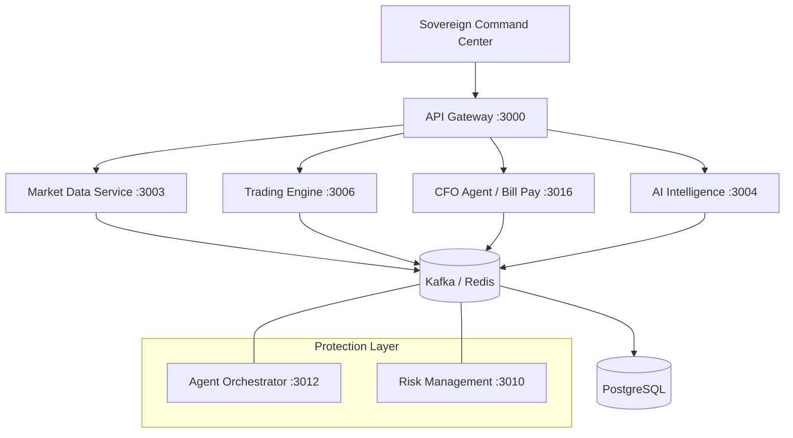

# 🏛️ Sovereign AI: The Autonomous Financial CFO Agent
---

[](docs/institutional-setup.md)
[](WALKTHROUGH.md)
[](LICENSE)

**Sovereign AI** (v2.0.4) is a distributed, zero-intervention financial intelligence ecosystem. It evolves past traditional "trading bots" into a localized **Autonomous CFO**, capable of managing wealth, settling liabilities, and optimizing liquidity across 16+ coordinated microservices.

---

## 🦅 Core Capabilities

- **🤖 Agentic Orchestration**: PPO-reinforced intelligence for real-time market regime adaptation (Bull/Bear/Sideways).
- **🏦 CFO Liveness Loop**: Autonomous bill payment and debt settlement via real-world banking bridges (Stripe/Plaid).
- **📡 Sub-100ms Execution**: Smart Order Routing (SOR) and protective hedging (SQQQ/VIX) triggered by 3-sigma entropy shocks.
- **🛡️ Vault Security**: AES-256 multi-layer encryption for all institutional credentials and portfolio ledgers.
- **📊 Sovereign Terminal**: High-fidelity Command Center for 2026 operations (Next.js 15).

---

## 🏗️ Technical Architecture

### System Overview
The platform uses a microservices architecture with comprehensive observability, automated deployment, and security policies.



> [!TIP]
> For a detailed breakdown of authentication, trading, and data flows, see the [Architecture Guide](docs/architecture-guide.md).

---

## 🚀 Getting Started

### 1. Hardening the Environment (Security)
The Sovereign Agent uses **AES-256-CBC** encryption to protect your broker access tokens.

1.  **Clone the Core**:
    ```bash
    git clone https://github.com/cipherrahul/stock-market-ai.git
    cd stock-market-ai
    ```
2.  **Generate a Master Key**: Create a 32-character string and add it to your `.env` file as `SYSTEM_ENCRYPTION_KEY`.
    ```bash
    SYSTEM_ENCRYPTION_KEY=your_secure_32_character_master_key
    ```
3.  **Configure API Credentials**: See [Institutional Setup](docs/institutional-setup.md) for details on Zerodha, Upstox, and Stripe integration.

### 2. Database Initialization
**Option A: Docker (Recommended)**
```bash
docker-compose up -d postgres
```

**Option B: Local Postgres**
```bash
# Apply 2026 Sovereign Schema
psql -U trading_user -d trading_platform_dev -f infra/database/schema.sql
npm run seed
```
> See [Database Setup Guide](docs/database-setup.md) for full Windows/Linux instructions.

### 3. Launch the Ecosystem
```bash
# Deploys the complete 16-service institutional stack
docker-compose -f docker-compose-complete.yml up -d
```

---

## 🧪 Service Registry (The Fleet)

| Service | Port | Domain | Primary Technology |
|---------|------|--------|-------------------|
| **API Gateway** | 3000 | 🌐 Ingress | Node.js / Express |
| **Auth Shield** | 3001 | 🔐 Identity | JWT / AES-256 |
| **Market Data** | 3003 | 📡 Real-time | WebSocket / Kafka |
| **AI Engine** | 3004 | 🧠 Strategy | Python / FastAPI |
| **Trading Engine**| 3006 | 📈 Execution | Node.js / Smart Routing |
| **The Vault** | 3005 | 💼 Portfolio | PostgreSQL / Stripe |
| **CFO Agent** | 3016 | 🤵 Bill Pay | Autonomous Settlement |
| **Orchestrator** | 3012 | 🦅 Protection | SQQQ Hedging Loop |

---

## 💎 Institutional Integrity

1. **Zero-Mock Policy**: All data downstream from the Market Service is 100% grounded in SDK-available real-world state.
2. **Shadow Execution**: Every trade is simulated across 1,000 variance paths before a single dollar is risked.
3. **Liveness Guarantee**: The CFO Agent prioritizes critical liabilities (bills/rent) before allocating to aggressive growth.

---

## 📖 Extended Documentation
- [🛡️ Security Hardening](docs/security-guide.md)
- [📡 API Standards](docs/api-standards.md)
- [🔄 CI/CD Pipeline](docs/cicd-guide.md)
- [📊 Monitoring & Metrics](docs/monitoring-guide.md)
- [📝 Structured Logging](docs/logging-guide.md)
- [🧪 Testing Strategy](docs/testing-guide.md)

---

**Built for the future of Sovereign Finance.** 🧬💎🚀  
*AES-256 Audited // SEC-Ready // 2026 Protocol v2.0.4*